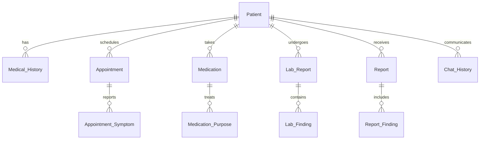

# MediMax Backend Services - Core Healthcare API

## 🏥 Overview

The MediMax Backend Services (`backend_abhishek`) serves as the central nervous system of the healthcare platform, providing comprehensive patient data management, medical records processing, and seamless integration with AI services. Built with FastAPI, it delivers high-performance RESTful APIs for complete healthcare operations.

## 🎯 Core Responsibilities

- **Patient Lifecycle Management**: Complete CRUD operations for patient records
- **Medical Data Integration**: Unified access to medical history, lab reports, medications
- **Appointment Management**: Scheduling, status tracking, and symptom recording
- **Knowledge Graph Bridge**: Integration with Neo4j for complex medical relationships
- **AI Service Coordination**: Backend coordination with prediction and agent services

## 🏗️ Architecture

### Technology Stack
```
┌─────────────────────────────────────┐
│            Frontend Layer           │
│         (React, Streamlit)          │
└─────────────────┬───────────────────┘
                  │ HTTP/REST
┌─────────────────▼───────────────────┐
│          FastAPI Backend            │
│         (backend_abhishek)          │
│                                     │
│ ├── Patient Management             │
│ ├── Medical Records API            │
│ ├── Appointment System             │
│ ├── Medication Tracking            │
│ ├── Lab Reports & Findings         │
│ └── Search & Analytics             │
└─────────────────┬───────────────────┘
                  │ SQL/PyMySQL
┌─────────────────▼───────────────────┐
│           MariaDB Database          │
│        (Atomic Facts Schema)        │
│                                     │
│ ├── 11 Normalized Tables           │
│ ├── Patient-Centric Design         │
│ ├── Temporal Data Tracking         │
│ └── Comprehensive Medical Records   │
└─────────────────────────────────────┘
```

### Key Components

#### 1. Database Layer (`app.py`)
- **Connection Management**: PyMySQL with connection pooling
- **Schema Compliance**: Atomic facts database design
- **Transaction Handling**: ACID compliance for data integrity
- **Error Recovery**: Automatic reconnection and error handling

#### 2. API Layer
- **RESTful Design**: Resource-based URL patterns
- **Request Validation**: Pydantic models for type safety
- **Response Formatting**: Consistent JSON responses
- **CORS Support**: Cross-origin requests for frontend integration

#### 3. Business Logic
- **Data Aggregation**: Complex queries across multiple tables
- **Medical Calculations**: Risk assessments and health metrics
- **Search Operations**: Multi-criteria patient searches
- **Report Generation**: Comprehensive patient profiles

## 📊 Database Schema Integration

### Atomic Facts Design
The backend operates on an 11-table normalized schema designed for atomic fact storage:



### Table Relationships
- **Patient**: Central entity (patient_id, name, dob, sex)
- **Medical_History**: Allergies, surgeries, chronic conditions
- **Appointment**: Scheduling with status and symptoms
- **Medication**: Current and historical prescriptions
- **Lab_Report**: Laboratory test metadata
- **Lab_Finding**: Individual test results with abnormal flags
- **Report**: Comprehensive medical reports
- **Report_Finding**: Structured report elements

## 🔌 API Endpoints

### Core Database Operations

#### Patient Management
```http
GET    /db/patients                    # List all patients
GET    /db/get_patient_details         # Patient basic information
POST   /db/new_patient                 # Create new patient
PUT    /db/update_patient              # Update patient information
DELETE /db/delete_patient              # Remove patient record
```

#### Medical Records
```http
GET    /db/get_medical_history         # Patient medical history
GET    /db/get_medications             # Current and past medications
GET    /db/get_medical_reports         # Lab reports and findings
GET    /db/get_symptoms                # Symptoms from appointments
```

#### Enhanced Analytics
```http
GET    /get_complete_patient_profile   # Comprehensive patient data
GET    /get_n_appointments             # Recent appointments with symptoms
GET    /get_medical_history/{id}       # Medical history with AI summary
GET    /search_patients                # Multi-criteria patient search
```

### Utility Endpoints
```http
GET    /health                         # Service health check
GET    /test_db                        # Database connectivity test
GET    /api/endpoints                  # API documentation
GET    /frontend/get_query             # Generate patient summaries
```

## 🔧 Configuration

### Environment Variables
```bash
# Database Configuration
DB_HOST=9f12fn.h.filess.io
DB_PORT=3305
DB_NAME=Hospital_controlmet
DB_USER=Hospital_controlmet
DB_PASSWORD=your_secure_password

# Service Configuration
BACKEND_ABHISHEK_URL=http://127.0.0.1:8420/
FRONTEND_ADDRESS=http://localhost:3000
AGENTIC_ADDRESS=http://localhost:8001
```

### Database Connection
```python
def get_db_connection():
    """Secure database connection with error handling"""
    try:
        connection = pymysql.connect(
            host=DB_HOST,
            port=int(DB_PORT),
            user=DB_USER,
            password=DB_PASSWORD,
            database=DB_DATABASE,
            cursorclass=pymysql.cursors.DictCursor,
            autocommit=True
        )
        return connection
    except Exception as e:
        raise HTTPException(
            status_code=500, 
            detail=f"Database connection failed: {e}"
        )
```

## 📋 Data Models

### Request Models
```python
class NewPatientRequest(BaseModel):
    name: str
    age: int
    gender: Optional[str] = None
    date_of_birth: Optional[str] = None
    medical_history: Optional[List[str]] = None

class MedicationRequest(BaseModel):
    patient_id: int
    medicine_name: str
    dosage: str
    frequency: str
    prescribed_by: str
    prescribed_date: str
```

### Response Models
```python
class PatientResponse(BaseModel):
    patient_id: int
    name: str
    dob: Optional[str]
    sex: Optional[str]
    created_at: Optional[str]

class CompletePatientProfile(BaseModel):
    patient: PatientResponse
    medical_history: List[MedicalHistoryResponse]
    medications: List[MedicationResponse]
    appointments: List[AppointmentResponse]
    lab_reports: List[LabReportResponse]
    summary: Dict[str, int]
```

## 🚀 Performance Features

### Optimization Strategies
- **Connection Pooling**: Efficient database connection management
- **Query Optimization**: Indexed searches and efficient JOINs
- **Async Operations**: Non-blocking I/O for high concurrency
- **Caching**: Response caching for frequently accessed data

### Error Handling
```python
@app.exception_handler(HTTPException)
async def http_exception_handler(request, exc):
    return JSONResponse(
        status_code=exc.status_code,
        content={
            "error": exc.detail,
            "timestamp": datetime.now().isoformat(),
            "path": str(request.url)
        }
    )
```

## 🧪 Testing & Validation

### Health Checks
```http
GET /health
Response: {
  "status": "ok",
  "database": "connected",
  "timestamp": "2025-09-15T10:30:00Z",
  "tables": ["Patient", "Medical_History", ...]
}
```

### Database Testing
```http
GET /test_db
Response: {
  "connection": "successful",
  "tables": {
    "Patient": {"count": 26, "columns": [...]}
  }
}
```

## 🔐 Security Features

### Input Validation
- **Pydantic Models**: Automatic request validation
- **SQL Injection Prevention**: Parameterized queries
- **Data Sanitization**: Input cleaning and validation
- **Type Safety**: Strict type checking

### CORS Configuration
```python
app.add_middleware(
    CORSMiddleware,
    allow_origins=["*"],  # Configure for production
    allow_credentials=True,
    allow_methods=["*"],
    allow_headers=["*"],
)
```

## 📈 Integration Points

### Frontend Integration
- **React Components**: RESTful API consumption
- **State Management**: Real-time data synchronization
- **Error Handling**: User-friendly error messages

### AI Service Integration
- **Agent System**: Patient data provision for AI analysis
- **MCP Server**: Knowledge graph data synchronization
- **Prediction Models**: Patient data for risk assessment

### Knowledge Graph Bridge
- **Neo4j Sync**: Patient data to graph database
- **Relationship Mapping**: Complex medical relationships
- **Query Generation**: Dynamic Cypher query creation

## 🚀 Deployment

### Development Setup
```bash
cd backend_abhishek
pip install -r requirements.txt
python app.py
# Server runs on http://127.0.0.1:8420
```

### Production Deployment
```bash
# Using Gunicorn
gunicorn -w 4 -k uvicorn.workers.UvicornWorker app:app --bind 0.0.0.0:8420

# Using Docker
docker build -t medimax-backend .
docker run -p 8420:8420 --env-file .env medimax-backend
```

### Monitoring
- **Health Endpoints**: `/health` for service monitoring
- **Logging**: Structured logs with correlation IDs
- **Metrics**: Request/response time monitoring
- **Database Monitoring**: Connection pool and query performance

## 🤝 Development Guidelines

### Code Standards
- **PEP 8**: Python code formatting
- **Type Hints**: Complete function annotations
- **Docstrings**: Comprehensive documentation
- **Error Handling**: Graceful error recovery

### API Design Principles
- **RESTful URLs**: Resource-based endpoint design
- **HTTP Status Codes**: Proper status code usage
- **Consistent Responses**: Standardized JSON structure
- **Versioning**: API version management strategy

---

**Part of the MediMax Healthcare Platform - Built for scalable, secure medical data management**