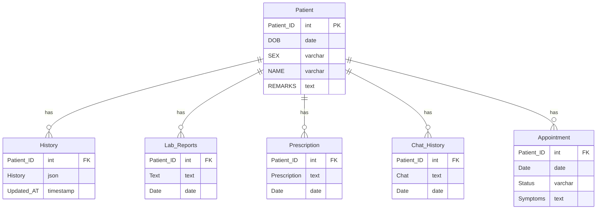

# MediMax Database Schema

This document describes the database schema for the MediMax healthcare management system. The database consists of 6 tables designed to store patient information, medical history, lab reports, prescriptions, chat interactions, and appointments.

## Database Overview

The MediMax database is built on MariaDB/MySQL and follows a relational structure with the `Patient` table as the central entity. All other tables maintain foreign key relationships to the `Patient` table, enabling comprehensive patient-centric healthcare data management.

## Table Descriptions

### 1. Patient Table
**Purpose**: Stores basic demographic and identification information for all patients in the system.

**Columns**:
- `Patient_ID` (INT, Primary Key, Auto-increment): Unique identifier for each patient
- `DOB` (DATE): Date of birth
- `SEX` (VARCHAR): Gender of the patient
- `NAME` (VARCHAR): Full name of the patient
- `REMARKS` (TEXT): Additional notes or remarks about the patient

**Relationships**: Parent table for all other tables in the database.

### 2. History Table
**Purpose**: Stores comprehensive medical history data for patients in JSON format, allowing flexible storage of various medical information.

**Columns**:
- `Patient_ID` (INT, Foreign Key): References Patient.Patient_ID
- `History` (LONGTEXT): JSON object containing medical history data (allergies, surgeries, medications, etc.)
- `Updated_AT` (TIMESTAMP): Timestamp of when the history was last updated (auto-updates on changes)

**Relationships**: Many-to-one with Patient table.

### 3. Lab_Reports Table
**Purpose**: Stores laboratory test results and medical reports associated with patients.

**Columns**:
- `Patient_ID` (INT, Foreign Key): References Patient.Patient_ID
- `Text` (TEXT): The content of the lab report or test results
- `Date` (DATE): Date when the lab report was generated

**Relationships**: Many-to-one with Patient table.

### 4. Prescription Table
**Purpose**: Records medication prescriptions issued to patients.

**Columns**:
- `Patient_ID` (INT, Foreign Key): References Patient.Patient_ID
- `Prescription` (TEXT): Details of the prescribed medication including dosage and instructions
- `Date` (DATE): Date when the prescription was issued

**Relationships**: Many-to-one with Patient table.

### 5. Chat_History Table
**Purpose**: Maintains records of chat interactions between patients and healthcare providers through the chat API.

**Columns**:
- `Patient_ID` (INT, Foreign Key): References Patient.Patient_ID
- `Chat` (TEXT): Content of the chat message or conversation
- `Date` (DATE): Date of the chat interaction

**Relationships**: Many-to-one with Patient table.

### 6. Appointment Table
**Purpose**: Manages patient appointments including scheduling, status, and symptoms.

**Columns**:
- `Patient_ID` (INT, Foreign Key): References Patient.Patient_ID
- `Date` (DATE): Scheduled date of the appointment
- `Status` (VARCHAR): Current status of the appointment (e.g., Scheduled, Confirmed, Pending)
- `Symptoms` (TEXT): Description of symptoms or reason for the appointment

**Relationships**: Many-to-one with Patient table.

## Entity Relationship Diagram

## Data Types and Constraints

- **Primary Key**: `Patient.Patient_ID` (auto-increment integer)
- **Foreign Keys**: All tables except Patient have `Patient_ID` as foreign key referencing `Patient.Patient_ID`
- **Data Types**:
  - Dates: DATE format (YYYY-MM-DD)
  - Timestamps: TIMESTAMP with auto-update
  - Text fields: TEXT for longer content, LONGTEXT for JSON data
  - Strings: VARCHAR with appropriate lengths
- **Nullability**: Patient_ID in Patient table is NOT NULL, all other fields allow NULL values

## Usage Notes

1. **Patient Registration**: Always create a Patient record first before adding related data
2. **Data Integrity**: Foreign key constraints ensure that related records cannot exist without a valid patient
3. **JSON Storage**: The History table uses JSON format for flexible medical data storage
4. **Audit Trail**: Updated_AT in History table automatically tracks changes
5. **Multi-record Support**: All child tables support multiple records per patient

## Sample Data

The database currently contains sample data for 5 patients with corresponding records in all related tables, demonstrating the relationships and data structure.