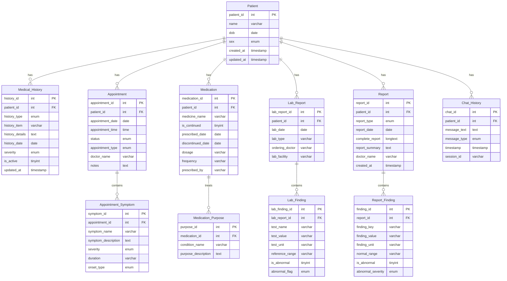

# MediMax Database Schema

This document describes the database schema for the MediMax healthcare management system. The database consists of 11 normalized tables designed to store comprehensive patient information, medical history, lab reports, medications, appointments, symptoms, and chat interactions.

## Database Overview

The MediMax database is built on MariaDB/MySQL and follows a fully normalized relational structure with the `Patient` table as the central entity. The schema implements atomic facts design principles, where each table stores specific, granular medical information. This normalization enables efficient knowledge graph creation, detailed medical analytics, and comprehensive patient-centric healthcare data management.

## Table Descriptions

### 1. Patient Table (Central Entity)
**Purpose**: Stores basic demographic and identification information for all patients in the system.

**Columns**:
- `patient_id` (INT, Primary Key, Auto-increment): Unique identifier for each patient
- `name` (VARCHAR, NOT NULL): Full name of the patient
- `dob` (DATE): Date of birth
- `sex` (ENUM): Gender of the patient ('Male', 'Female', 'Other')
- `created_at` (TIMESTAMP): Record creation timestamp
- `updated_at` (TIMESTAMP): Last update timestamp (auto-updates on changes)

**Relationships**: Parent table for all other tables in the database.

### 2. Medical_History Table
**Purpose**: Stores structured medical history data with categorized information types.

**Columns**:
- `history_id` (INT, Primary Key, Auto-increment): Unique identifier for each history record
- `patient_id` (INT, Foreign Key): References Patient.patient_id
- `history_type` (ENUM): Type of medical history ('allergy', 'surgery', 'chronic_condition', 'family_history', 'lifestyle')
- `history_item` (VARCHAR): Specific item or condition name
- `history_details` (TEXT): Detailed description of the medical history item
- `history_date` (DATE): Date when the medical event occurred
- `severity` (ENUM): Severity level ('Mild', 'Moderate', 'Severe', 'Critical')
- `is_active` (TINYINT): Whether the condition is currently active (1=active, 0=inactive)
- `updated_at` (TIMESTAMP): Last update timestamp

**Relationships**: Many-to-one with Patient table.

### 3. Appointment Table
**Purpose**: Manages patient appointments including scheduling, status, and appointment details.

**Columns**:
- `appointment_id` (INT, Primary Key, Auto-increment): Unique identifier for each appointment
- `patient_id` (INT, Foreign Key): References Patient.patient_id
- `appointment_date` (DATE, NOT NULL): Scheduled date of the appointment
- `appointment_time` (TIME): Scheduled time of the appointment
- `status` (ENUM): Current status ('Scheduled', 'Confirmed', 'Pending', 'Completed', 'Cancelled', 'No_Show')
- `appointment_type` (ENUM): Type of appointment ('Regular', 'Emergency', 'Follow_up', 'Consultation', 'Surgery')
- `doctor_name` (VARCHAR): Name of the attending doctor
- `notes` (TEXT): Additional notes or remarks about the appointment

**Relationships**: Many-to-one with Patient table; One-to-many with Appointment_Symptom table.

### 4. Appointment_Symptom Table
**Purpose**: Records symptoms associated with specific appointments, enabling detailed symptom tracking.

**Columns**:
- `symptom_id` (INT, Primary Key, Auto-increment): Unique identifier for each symptom record
- `appointment_id` (INT, Foreign Key): References Appointment.appointment_id
- `symptom_name` (VARCHAR, NOT NULL): Name of the symptom
- `symptom_description` (TEXT): Detailed description of the symptom
- `severity` (ENUM): Severity level ('Mild', 'Moderate', 'Severe', 'Critical')
- `duration` (VARCHAR): How long the symptom has been present
- `onset_type` (ENUM): Type of symptom onset ('Sudden', 'Gradual', 'Chronic', 'Intermittent')

**Relationships**: Many-to-one with Appointment table.

### 5. Medication Table
**Purpose**: Records current and historical medication information for patients.

**Columns**:
- `medication_id` (INT, Primary Key, Auto-increment): Unique identifier for each medication record
- `patient_id` (INT, Foreign Key): References Patient.patient_id
- `medicine_name` (VARCHAR, NOT NULL): Name of the medication
- `is_continued` (TINYINT): Whether the medication is currently being taken (1=continued, 0=discontinued)
- `prescribed_date` (DATE, NOT NULL): Date when the medication was prescribed
- `discontinued_date` (DATE): Date when the medication was discontinued (if applicable)
- `dosage` (VARCHAR): Dosage information
- `frequency` (VARCHAR): Frequency of medication intake
- `prescribed_by` (VARCHAR): Name of the prescribing doctor

**Relationships**: Many-to-one with Patient table; One-to-many with Medication_Purpose table.

### 6. Medication_Purpose Table
**Purpose**: Links medications to the specific conditions they are treating, enabling multi-purpose medication tracking.

**Columns**:
- `purpose_id` (INT, Primary Key, Auto-increment): Unique identifier for each medication purpose
- `medication_id` (INT, Foreign Key): References Medication.medication_id
- `condition_name` (VARCHAR, NOT NULL): Name of the condition being treated
- `purpose_description` (TEXT): Detailed description of the medication's purpose

**Relationships**: Many-to-one with Medication table.

### 7. Lab_Report Table
**Purpose**: Stores laboratory test reports and metadata.

**Columns**:
- `lab_report_id` (INT, Primary Key, Auto-increment): Unique identifier for each lab report
- `patient_id` (INT, Foreign Key): References Patient.patient_id
- `lab_date` (DATE, NOT NULL): Date when the lab test was performed
- `lab_type` (VARCHAR): Type of laboratory test
- `ordering_doctor` (VARCHAR): Name of the doctor who ordered the test
- `lab_facility` (VARCHAR): Name of the laboratory facility

**Relationships**: Many-to-one with Patient table; One-to-many with Lab_Finding table.

### 8. Lab_Finding Table
**Purpose**: Stores individual test results and findings within lab reports, enabling granular analysis.

**Columns**:
- `lab_finding_id` (INT, Primary Key, Auto-increment): Unique identifier for each lab finding
- `lab_report_id` (INT, Foreign Key): References Lab_Report.lab_report_id
- `test_name` (VARCHAR, NOT NULL): Name of the specific test
- `test_value` (VARCHAR, NOT NULL): Result value of the test
- `test_unit` (VARCHAR): Unit of measurement for the test value
- `reference_range` (VARCHAR): Normal reference range for the test
- `is_abnormal` (TINYINT): Whether the result is abnormal (1=abnormal, 0=normal)
- `abnormal_flag` (ENUM): Type of abnormality ('High', 'Low', 'Critical_High', 'Critical_Low')

**Relationships**: Many-to-one with Lab_Report table.

### 9. Report Table
**Purpose**: Stores comprehensive medical reports including radiology, pathology, and clinical reports.

**Columns**:
- `report_id` (INT, Primary Key, Auto-increment): Unique identifier for each report
- `patient_id` (INT, Foreign Key): References Patient.patient_id
- `report_type` (ENUM): Type of report ('Radiology', 'Pathology', 'Clinical', 'Discharge', 'Consultation')
- `report_date` (DATE, NOT NULL): Date when the report was generated
- `complete_report` (LONGTEXT): Full text of the medical report
- `report_summary` (TEXT): Summary or key findings from the report
- `doctor_name` (VARCHAR): Name of the reporting doctor
- `created_at` (TIMESTAMP): Record creation timestamp

**Relationships**: Many-to-one with Patient table; One-to-many with Report_Finding table.

### 10. Report_Finding Table
**Purpose**: Extracts and stores specific findings from medical reports for structured analysis.

**Columns**:
- `finding_id` (INT, Primary Key, Auto-increment): Unique identifier for each finding
- `report_id` (INT, Foreign Key): References Report.report_id
- `finding_key` (VARCHAR, NOT NULL): Key or category of the finding
- `finding_value` (VARCHAR, NOT NULL): Value or description of the finding
- `finding_unit` (VARCHAR): Unit of measurement (if applicable)
- `normal_range` (VARCHAR): Normal range for the finding
- `is_abnormal` (TINYINT): Whether the finding is abnormal (1=abnormal, 0=normal)
- `abnormal_severity` (ENUM): Severity of abnormality ('Mild', 'Moderate', 'Severe', 'Critical')

**Relationships**: Many-to-one with Report table.

### 11. Chat_History Table
**Purpose**: Maintains records of chat interactions between patients and healthcare providers through the chat API.

**Columns**:
- `chat_id` (INT, Primary Key, Auto-increment): Unique identifier for each chat message
- `patient_id` (INT, Foreign Key): References Patient.patient_id
- `message_text` (TEXT, NOT NULL): Content of the chat message
- `message_type` (ENUM): Type of message ('Patient', 'Provider', 'System', 'Bot')
- `timestamp` (TIMESTAMP): Timestamp of the message
- `session_id` (VARCHAR): Session identifier for grouping related messages

**Relationships**: Many-to-one with Patient table.

**Relationships**: Many-to-one with Patient table.

### 5. Chat_History Table
**Purpose**: Maintains records of chat interactions between patients and healthcare providers through the chat API.

**Columns**:
- `Patient_ID` (INT, Foreign Key): References Patient.Patient_ID
- `Chat` (TEXT): Content of the chat message or conversation
- `Date` (DATE): Date of the chat interaction

**Relationships**: Many-to-one with Patient table.

### 6. Appointment Table
**Purpose**: Manages patient appointments including scheduling, status, and symptoms.

**Columns**:
- `Patient_ID` (INT, Foreign Key): References Patient.Patient_ID
- `Date` (DATE): Scheduled date of the appointment
- `Status` (VARCHAR): Current status of the appointment (e.g., Scheduled, Confirmed, Pending)
- `Symptoms` (TEXT): Description of symptoms or reason for the appointment

**Relationships**: Many-to-one with Patient table.

## Entity Relationship Diagram

## Data Types and Constraints

- **Primary Keys**: Each table has an auto-increment integer primary key
- **Foreign Keys**: All child tables reference `Patient.patient_id` directly or indirectly
- **Data Types**:
  - Dates: DATE format (YYYY-MM-DD)
  - Times: TIME format (HH:MM:SS)
  - Timestamps: TIMESTAMP with auto-update capabilities
  - Text fields: TEXT for content, LONGTEXT for large documents
  - Strings: VARCHAR with appropriate lengths
  - Enums: Predefined value sets for consistency
  - Boolean flags: TINYINT (0/1) for binary states
- **Nullability**: Primary keys and essential fields are NOT NULL
- **Indexes**: Strategic indexing on foreign keys and frequently queried fields

## Key Features

### Atomic Facts Design
The database implements atomic facts principles where:
- Each table stores granular, specific information
- Complex relationships are broken down into simple facts
- Data normalization prevents redundancy
- Easy knowledge graph generation from normalized structure

### Enhanced Medical Data Tracking
- **Granular Symptom Tracking**: Individual symptoms linked to specific appointments
- **Medication Purpose Mapping**: Multiple conditions per medication
- **Detailed Lab Analysis**: Individual test results with abnormality detection
- **Structured Report Findings**: Key findings extracted from narrative reports
- **Temporal Data**: Comprehensive timestamp tracking for audit trails

### Knowledge Graph Ready
- **Patient-Centric Design**: All data flows from patient entities
- **Rich Relationships**: Multiple connection types between entities
- **Semantic Structure**: Meaningful relationships for AI/ML processing
- **Normalized Facts**: Clean data structure for graph algorithms

## Usage Notes

1. **Patient Registration**: Always create a Patient record first before adding related data
2. **Data Integrity**: Foreign key constraints ensure referential integrity
3. **Atomic Recording**: Each medical fact is stored as a separate, specific record
4. **Temporal Tracking**: Most tables include date/timestamp fields for historical analysis
5. **Multi-record Support**: All child tables support multiple records per patient
6. **Enumerated Values**: Consistent vocabulary through ENUM constraints
7. **Knowledge Graph Integration**: Structure optimized for automated graph generation

## Sample Data

The database contains rich sample data for multiple patients including:
- **Patient 5**: Basic medical profile with standard appointments and medications
- **Patient 6 (Dr. Sarah Mitchell)**: Healthcare provider with comprehensive medical history
- **Patient 7 (Maria Elena Gonzalez)**: Super rich patient case with extensive medical data across all tables

## MCP Integration

The database is fully integrated with the MCP (Model Context Protocol) server which provides:
- **Automated Knowledge Graph Creation**: Patient-centric graph generation from atomic facts
- **Real-time Data Synchronization**: Backend synchronization capabilities
- **Advanced Analytics**: AI-powered medical insights and predictions
- **API Access**: RESTful and MCP protocol access to all data

## Backup Tables

The database includes backup tables (`*_backup`) that preserve legacy schema versions:
- Historical data preservation during schema migration
- Rollback capabilities for data recovery
- Schema evolution tracking