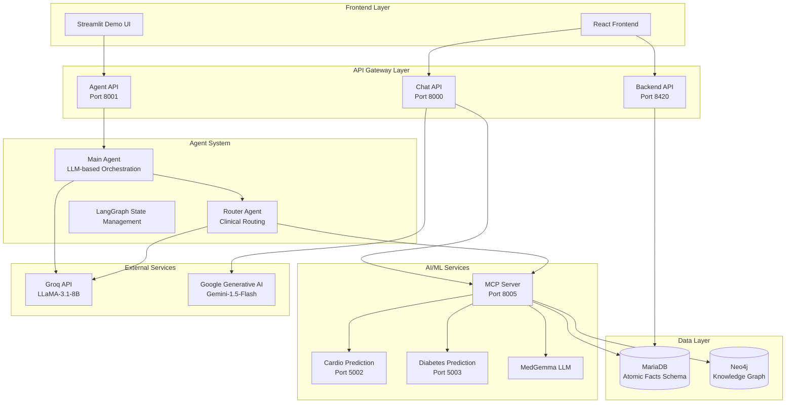

# MediMax - Comprehensive Healthcare Management System


## 🌟 Overview

**MediMax** is a cutting-edge, AI-powered healthcare management system that revolutionizes patient care through intelligent data management, predictive analytics, and seamless multi-agent orchestration. The system integrates advanced machine learning models with comprehensive patient data management to provide healthcare professionals with unprecedented insights and decision-making capabilities.

### 🎯 Key Features

- **🏥 Comprehensive Patient Management**: Complete lifecycle management with atomic facts database design
- **🤖 AI-Powered Risk Assessment**: Cardiovascular and diabetes risk prediction with SHAP explanations
- **💬 Intelligent Chat Interface**: LangChain-powered conversational AI with medical knowledge
- **📊 Knowledge Graph Integration**: Neo4j-based patient-centric medical knowledge graphs
- **🔄 Multi-Agent Orchestration**: LLM-based agent coordination for complex medical assessments
- **📱 Modern Frontend**: React-based responsive web interface
- **🔒 Enterprise-Grade Architecture**: Microservices with Docker containerization

## 🏗️ System Architecture

### High-Level Architecture



### Technology Stack

| Layer | Technologies |
|-------|-------------|
| **Frontend** | React, Vite, TailwindCSS, Streamlit |
| **Backend APIs** | FastAPI, Python 3.8+, Pydantic |
| **AI/ML** | XGBoost, SHAP, LangChain, LangGraph |
| **LLM Services** | Groq LLaMA-3.1-8B, Google Gemini-1.5-Flash, MedGemma |
| **Databases** | MariaDB/MySQL, Neo4j AuraDB |
| **Infrastructure** | Docker, Docker Compose, MCP Protocol |
| **Monitoring** | Comprehensive logging, Health checks |

## 📂 Project Structure

```
MediMax/
├── 📁 Anugrah/                          # Multi-Agent Orchestration System
│   ├── 📁 agents/                       # LLM-based medical agents
│   │   ├── 🐍 api_server.py            # FastAPI server for agent system
│   │   ├── 🐍 app.py                   # Streamlit demo interface
│   │   ├── 📁 medimax/                 # Agent implementation modules
│   │   ├── 📁 tests/                   # Agent system tests
│   │   └── 📄 README.md                # Agent system documentation
│   └── 📁 front-end/                   # React frontend application
│       ├── 📄 package.json
│       ├── 📄 vite.config.js
│       └── 📄 tailwind.config.js
├── 📁 AI_Models/                        # Machine Learning Services
│   ├── 📁 cardio/                      # Cardiovascular Risk Prediction
│   │   ├── 🐍 cardiovascular_api.py   # Cardio prediction API
│   │   ├── 🗃️ xgboost_model.pkl        # Trained XGBoost model
│   │   └── 📄 Cardiovascular_API_Documentation.md
│   └── 📁 diabetes/                    # Diabetes Risk Prediction
│       ├── 🐍 diabetes_api.py          # Diabetes prediction API
│       ├── 🗃️ diabetes_xgboost_model.pkl # Trained XGBoost model
│       └── 📄 Diabetes_API_Documentation.md
├── 📁 backend_abhishek/                 # Core Backend Services
│   ├── 🐍 app.py                       # Main FastAPI backend
│   ├── 📄 API_DOCUMENTATION.md         # Comprehensive API docs
│   ├── 📄 DATABASE_DOCUMENTATION.md    # Database schema docs
│   └── 📄 README.md                    # Backend documentation
├── 📁 backend_noodles/                  # Chat & MCP Services
│   ├── 🐍 chat_api.py                  # LangChain chat interface
│   ├── 🐍 mcp_server.py                # Model Context Protocol server
│   └── 📄 README.md                    # Chat services documentation
├── 📁 scripts/                         # Utility scripts
├── 📁 Dockerised_Modules/              # Docker configurations
├── 📄 Database_Schema_README.md         # Database schema documentation
├── 📄 NEO4J_GRAPH_GUIDELINES.md        # Neo4j knowledge graph guide
├── 📄 NEO4J_RELATIONSHIP_SCHEMA.md     # Neo4j relationship mappings
├── 📄 docker-compose.backend.yml       # Docker composition
├── 📄 requirements.txt                 # Python dependencies
├── 📄 .env                            # Environment configuration
└── 📄 mcp.json                        # MCP server configuration
```

## 🚀 Quick Start Guide

### Prerequisites

- **Python 3.8+**
- **Node.js 16+** (for frontend)
- **Docker & Docker Compose**
- **MariaDB/MySQL 8.0+**
- **Neo4j AuraDB Account** (or local Neo4j)

### 🔧 Installation

#### 1. Clone and Setup Environment

```bash
# Clone the repository
git clone <repository-url>
cd MediMax

# Create and configure environment file
cp .env.example .env
# Edit .env with your API keys and database credentials
```

#### 2. Install Dependencies

```bash
# Install Python dependencies
pip install -r requirements.txt

# Install frontend dependencies
cd Anugrah/front-end
npm install
cd ../..

# Install agent system dependencies
cd Anugrah/agents
pip install -r requirements.txt
cd ../..
```

#### 3. Database Setup

```bash
# Setup MariaDB/MySQL database
# Import schema from Database_Schema_README.md

# Configure Neo4j AuraDB
# Update .env with your Neo4j credentials
```

#### 4. Start Services

```bash
# Option 1: Using Docker Compose (Recommended)
docker-compose -f docker-compose.backend.yml up -d

# Option 2: Manual startup
# Terminal 1: Start MCP Server
cd backend_noodles
python mcp_server.py

# Terminal 2: Start Chat API
python chat_api.py

# Terminal 3: Start Backend API
cd ../backend_abhishek
python app.py

# Terminal 4: Start AI Prediction Services
cd ../AI_Models/cardio
python cardiovascular_api.py
# In another terminal:
cd ../diabetes
python diabetes_api.py

# Terminal 5: Start Agent System
cd ../../Anugrah/agents
python api_server.py

# Terminal 6: Start Frontend
cd ../front-end
npm run dev
```

### 🧪 Verify Installation

```bash
# Check all services are running
curl http://localhost:8000/health     # Chat API
curl http://localhost:8420/health     # Backend API
curl http://localhost:8005/health     # MCP Server
curl http://localhost:5002/health     # Cardio API
curl http://localhost:5003/health     # Diabetes API
curl http://localhost:8001/health     # Agent API

# Frontend should be available at http://localhost:5173
```

## 📚 Component Documentation

### 🎯 [Backend Services](./backend_abhishek/README.md)
- **FastAPI Backend**: Core patient data management
- **Database Layer**: Atomic facts schema with comprehensive medical records
- **API Endpoints**: 50+ RESTful endpoints for complete healthcare operations

### 💬 [Chat & MCP Services](./backend_noodles/README.md)
- **Chat API**: LangChain-powered conversational interface with Google Gemini
- **MCP Server**: Model Context Protocol server for AI tool orchestration
- **Knowledge Graph**: Neo4j integration for patient-centric medical graphs

### 🤖 [Multi-Agent System](./Anugrah/agents/README.md)
- **LLM-Based Agents**: Groq LLaMA-3.1-8B powered intelligent agents
- **Clinical Routing**: Smart model selection and parameter validation
- **LangGraph Orchestration**: State-based agent coordination

### 🧠 [AI/ML Models](./AI_Models/)
- **[Cardiovascular Prediction](./AI_Models/cardio/Cardiovascular_API_Documentation.md)**: XGBoost with SHAP explanations
- **[Diabetes Risk Assessment](./AI_Models/diabetes/Diabetes_API_Documentation.md)**: Advanced risk prediction with feature importance

### 🎨 [Frontend Interface](./Anugrah/front-end/README.md)
- **React Application**: Modern, responsive healthcare interface
- **Streamlit Demo**: Interactive agent testing and demonstration

## 📊 Database Architecture

### MariaDB - Atomic Facts Schema
- **11 Normalized Tables**: Patient-centric design with atomic fact storage
- **Comprehensive Coverage**: Medical history, medications, lab reports, appointments
- **Temporal Tracking**: Complete audit trail with timestamps

### Neo4j - Knowledge Graph
- **18 Node Types**: Patient, Medication, Condition, Symptom, Lab Results, etc.
- **17 Relationship Types**: Complex medical relationships and dependencies
- **Patient-Centric**: All data connected through patient nodes

## 🔗 API Endpoints Overview

### Core Healthcare APIs (Port 8420)
- **Patient Management**: `/db/patients`, `/db/get_patient_details`
- **Medical Records**: `/db/get_medical_history`, `/db/get_medical_reports`
- **Appointments**: `/db/get_appointments`, `/db/get_symptoms`
- **Medications**: `/db/get_medications`, `/medication_management`

### AI/Chat APIs (Port 8000)
- **Conversational AI**: `POST /chat` - Natural language medical interactions
- **Memory Management**: Persistent conversation context

### Agent Orchestration (Port 8001)
- **Medical Assessment**: `POST /assess` - Multi-agent clinical analysis
- **Risk Prediction**: `/assess/cardiovascular`, `/assess/diabetes`

### MCP Tools (Port 8005)
- **Knowledge Graph**: Cypher query execution and graph management
- **Prediction Services**: Integrated cardiovascular and diabetes risk assessment
- **Patient Data**: Comprehensive patient information retrieval

## 🔒 Security & Configuration

### Environment Variables
```bash
# Database Configuration
DB_HOST=your_database_host
DB_PORT=3305
DB_NAME=Hospital_controlmet
DB_USER=your_username
DB_PASSWORD=your_password

# Neo4j Configuration
AURA_USER=your_neo4j_user
AURA_PASSWORD=your_neo4j_password

# API Keys
GOOGLE_API_KEY=your_google_api_key
GROQ_API_KEY=your_groq_api_key

# Service URLs
BACKEND_ABHISHEK_URL=http://127.0.0.1:8420/
```

### CORS Configuration
- **Development**: Wildcard origins for testing
- **Production**: Restricted to specific domains

## 🧪 Testing & Development

### Running Tests
```bash
# Backend API tests
cd backend_abhishek
python -m pytest tests/

# Agent system tests
cd Anugrah/agents
python test_orchestration.py

# MCP server tests
cd backend_noodles
python test_mcp_fixes.py
```

### Development Tools
- **API Documentation**: Auto-generated Swagger/OpenAPI docs at `/docs`
- **Health Monitoring**: Comprehensive health check endpoints
- **Logging**: Structured logging across all services

## 📈 Performance & Scalability

### Optimization Features
- **Asynchronous Processing**: FastAPI async endpoints
- **Connection Pooling**: Database connection management
- **Caching**: LLM response caching for common queries
- **Microservices**: Independent service scaling

### Monitoring
- **Health Checks**: All services provide health status
- **Error Handling**: Comprehensive exception management
- **Logging**: Structured logs with correlation IDs

## 🤝 Contributing

### Development Workflow
1. Fork the repository
2. Create feature branch: `git checkout -b feature/amazing-feature`
3. Commit changes: `git commit -m 'Add amazing feature'`
4. Push to branch: `git push origin feature/amazing-feature`
5. Open Pull Request

### Code Standards
- **Python**: PEP 8 compliance with type hints
- **JavaScript**: ESLint configuration
- **Documentation**: Comprehensive docstrings and README updates

## 📄 License

This project is licensed under the MIT License - see the [LICENSE](LICENSE) file for details.

## 🙏 Acknowledgments

- **LangChain**: For excellent LLM orchestration framework
- **FastAPI**: For high-performance async API framework
- **Neo4j**: For powerful graph database capabilities
- **XGBoost**: For robust machine learning models
- **React**: For modern frontend development

## 📞 Support

For support and questions:
- **Documentation**: Comprehensive docs in each component directory
- **Issues**: GitHub Issues for bug reports and feature requests
- **Discussions**: GitHub Discussions for community support

---

**Built with ❤️ for modern healthcare by the MediMax Team**